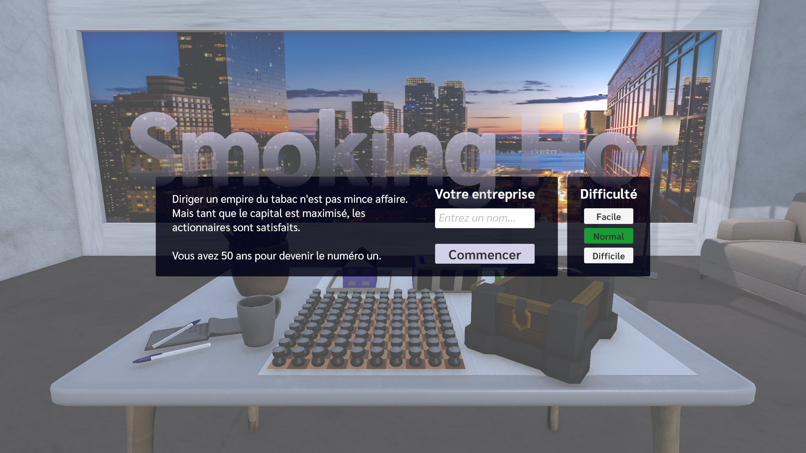
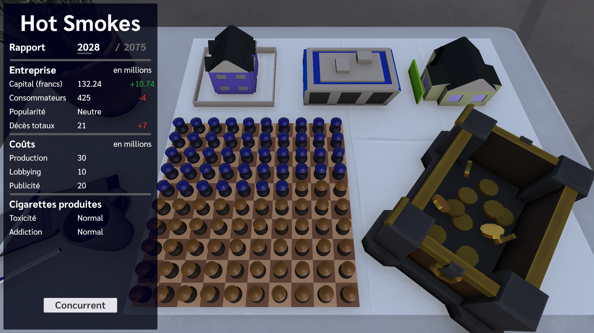
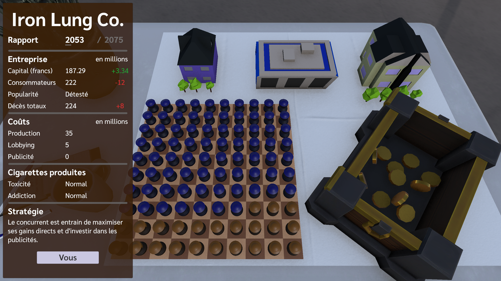
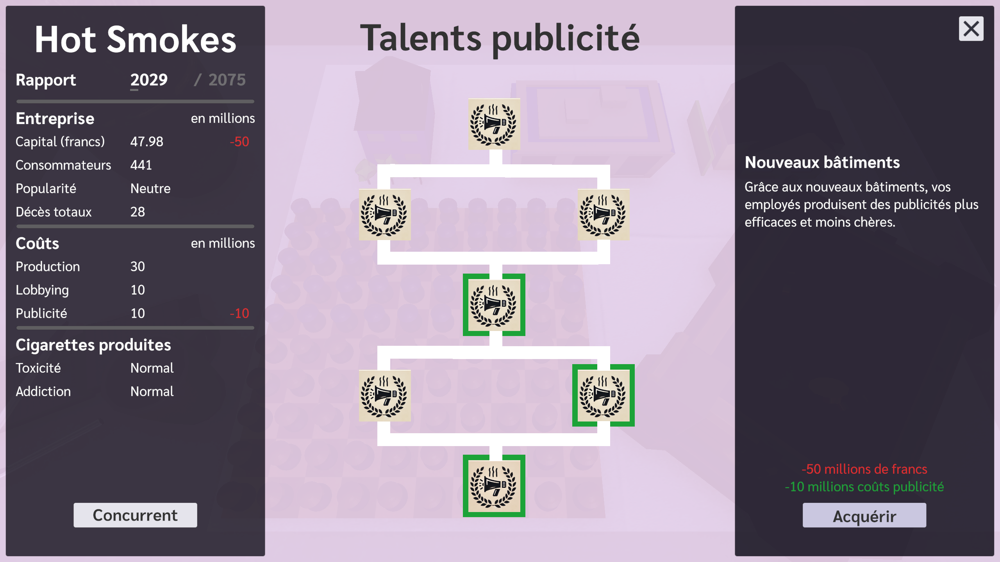
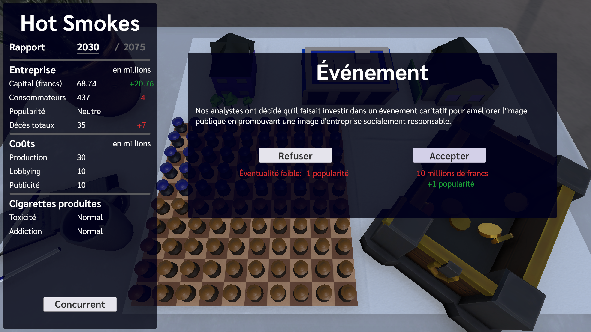
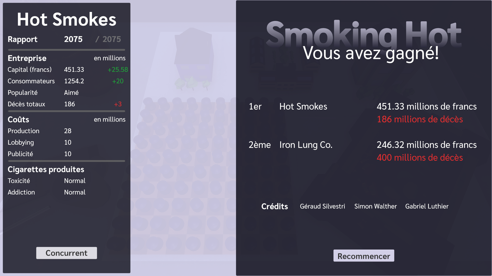

# Smoking Hot
Serious game produit lors du cours *Games Technologies (MA_GT)* au semestre d'automne 2024, dans le cadre du [Master of Science in Engineering (MSE)](https://www.hes-so.ch/master/hes-so-master/formations/engineering) de la [HES-SO](https://www.hes-so.ch/master).

Notre projet est un anti-jeux sérieux mettant en lumières, grâce à l'absurde de la surenchère et de l'exagération, les techniques de manipulation misent en place par les cigarettiers pour vendre leur produits. À travers ce jeu de gestion, vous incarnez un patron d'industrie du tabac dont le but est de maximiser son capital afin de battre son concurrent premier, au détriment des conséquences humaines.

Version d'Unity: `6000.0.20f1`

Résolutions du jeu (testées en variantes 16:9 et 16:10): **Full HD** (1920x1080), **QHD** (2560x1440), **4K UHD** (3840x2160)

## Contraintes du projet (imposées)
- Style: serious game
- Thème: Health
- Vue plateau de dessus, "faux" 2D
- Doit contenir de l'IA ~~ou/et du multi-joueur~~

## Documents de game design
- [00. Exploration du thème](doc/00_exploration.md)
- [01. Brainstorm](doc/01_brainstorm.md)
- [02. Gameplay](doc/02_gameplay.md)
- [03. Core Mechanics](doc/03_core_mechanics.md)
- [04. Gameplay & Core Mechanics V2](doc/04_gameplay_core_mechanics_v2.md)
- [05. New proposition](doc/05_nouvelle_proposition.md)
- [06. Core Mechanics V3](doc/06_core_mechanics_v3.md)

## Auteurs
- Géraud Silvestri
- Simon Walther
- Gabriel Luthier

## Captures d'écran
D'avantages sont disponible dans le dossier [screenshots](screenshots/).

